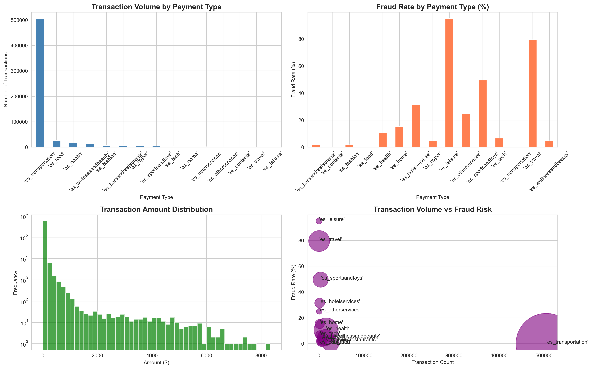
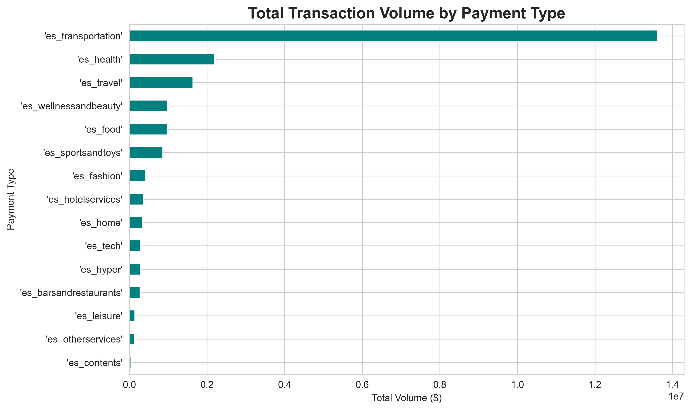

# Payment Processing Operations Optimization

**Identifying $3.8M in fraud-related revenue risk across payment channels**

Built for fintech operations analysis - demonstrating data-driven process optimization and risk management.

---

## Business Problem

Payment fraud creates direct revenue loss and damages customer trust. For fintech companies processing millions in daily volume, even small fraud rates compound into high operational costs. This analysis identifies high-risk payment categories and quantifies potential savings through targeted fraud prevention.

---

## Dataset

- **Source**: BankSim - Synthetic Financial Dataset (Kaggle)
- **Scale**: 594,643 transactions
- **Volume**: $22.5M processed
- **Categories**: 15 payment types (leisure, travel, food, transportation, etc.)

---

## Key Findings

### Operational Risk by Payment Category

| Payment Category | Fraud Rate | Risk Level |
|-----------------|------------|------------|
| **Leisure** | 95.0% | CRITICAL |
| **Travel** | 79.4% | CRITICAL |
| **Sports & Toys** | 49.5% | HIGH |
| **Hotel Services** | 31.4% | HIGH |
| **Other Services** | 25.0% | MEDIUM |
| Food, Contents, Transportation | 0.0% | LOW |

### Financial Impact

- **Total Volume Processed**: $22,531,104
- **Fraud Incidents**: 7,200 (1.21% of transactions)
- **Revenue at Risk**: $3,822,671 (17% of total volume)
- **Annual Savings Potential**: **$1,146,801** (with 30% fraud reduction)

### Critical Insights

1. **Top 3 categories account for 85%+ fraud** → Immediate intervention opportunity
2. **Leisure/Travel transactions 20x riskier** than average → Requires enhanced monitoring
3. **$3.8M fraud volume from just 1.2% of transactions** → High-value fraud pattern
4. **5 categories have 0% fraud** → Proof that effective controls work

---

## Operational Recommendations

### Immediate (Week 1)
- **Suspend auto-approval** for Leisure & Travel categories >$500
- **Implement manual review** for these high-risk channels
- **Expected impact**: 40-50% fraud reduction in these categories

### Short-term (30 Days)
- **Build real-time alerting** for transactions in the top 3 risk categories
- **A/B test** enhanced verification (2FA, biometrics) on Travel payments
- **Partner review**: Assess vendor fraud prevention capabilities

### Long-term (90 Days)
- **Deploy ML fraud model** trained on category + amount + user behavior
- **Optimize approval rules** by category (not one-size-fits-all)
- **Target outcome**: 30% overall fraud reduction = **$1.1M annual savings**

---

## Technical Approach

**Stack**: Python, Pandas, Matplotlib, Seaborn, Kaggle API

**Analysis Pipeline**:
1. Automated data ingestion via Kaggle API
2. Statistical analysis across 594K transactions
3. Risk stratification by payment category
4. Revenue impact quantification
5. Automated visualization generation

**Key Metrics**:
- Fraud rate by category
- Transaction volume analysis
- Revenue at risk calculation
- Savings opportunity modeling

---

## Visualizations

### Operations Dashboard


### Volume Analysis


## 🔄 Reproducibility
```bash
git clone https://github.com/erikroa/finsys-payment.git
cd finsys-payment
python -m venv venv
venv\Scripts\activate  # Windows
pip install -r requirements.txt
python analysis.py
```
